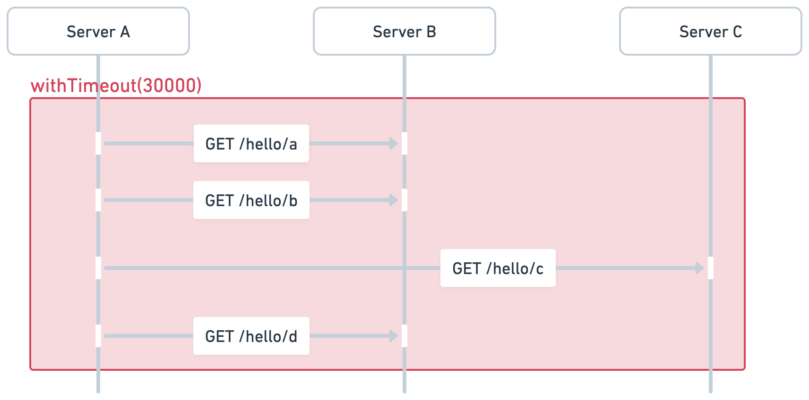
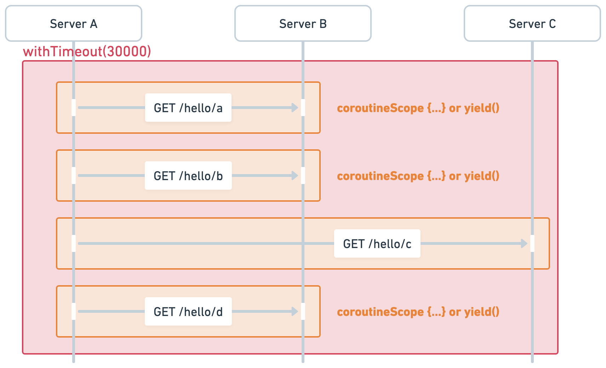

# Suspending vs. Blocking

코틀린 코루틴은 동시성 프로그램을 직관적으로 작성할 수 있도록 도와주는 유용한 도구다. 
하지만 내부 동작을 이해하지 못한 상태에서 사용할 경우 의도한 방향대로 동작이 이뤄지지 않는 경우도 다반사다.
그 원인중 하나가 바로 중단의 개념을 제대로 이해하지 못하느데에서 온다고 생각한다.

## 코루틴에서 중단이란?

코루틴에서 가장 흔히 사용하는 중단이란 개념은 코루틴을 멈추는 행위이자 동작을 의미한다.

* 함수에서는 `suspend fun` 이라는 키워드로 중단점을 만들 수 있다. 하지만 중단 함수 내부에 실제 중단을 일으키는 부분이 없을 경우 이름만 중단함수인 함수가 된다.
  ```kotlin
  suspend fun function() {
        println("blah blah")
  }
  ```
  위의 함수는 무늬만 중단 함수지 실제로 코루틴의 중단을 일으키지 않는다.
* 실질적으로 중단을 일으키는 가장 기본 함수는 `suspendCoroutine`이다. 가장 일반적으로 사용하는 `delay`도 `suspendCoroutine` 블록으로 구현되어 있다.

코루틴은 스레드 위에서 실행되는 중단 가능한 컴포넌트 혹은 태스크라고 정의할 수 있다. 
따라서 코루틴이 중단되었다는 것은 **스레드가 중단되었다는 의미가 아닌 잠시 태스크가 멈춘 상태**라고 이해해야 한다.

## coroutineScope vs. runBlocking

코루틴의 중단과 스레드의 블록킹의 차이를 이해하는데 좋은 예시가 바로 `coroutineScope`와 `runBlocking`을 이해하는 것이다.

### coroutineScope

`coroutineScope`는 코루틴 스코프(코루틴 스코프 = 코루틴으로 이해해도 크게 문제 없다) 없이 자체적으로 코루틴을 만들 수 있는 스코프 함수다.
보통 중단함수 내부에 코루틴을 생성해야 할 때 `coroutineScope` 블록을 정의해서 코루틴 빌더를 사용하게 된다.


`coroutineScope`의 특징을 나열해 보면;

* `coroutineScope`는 중단함수이면서 새로운 코루틴을 생성하는 함수다. 부모 코루틴의 컨텍스트를 받아 새로운 스코프를 만들며 내부의 코루틴이 완료될 때까지 부모 코루틴을 중단한다.
* `coroutineScope {...}` 블록 내부에 정의된 코루틴이 모두 끝날때까지 기다린다. 코루틴이 실행되고 있는 스레드를 블록 시키는 것이 아닌 코루틴을 기다리는 것이다.
* (참고) `coroutineScope`는 자기 자신 혹은 자식 스코프에서 발생한 예외를 부모로 전파하지 않고 바로 던지는 특징을 가지고 있다.

```Kotlin
@Test
fun coroutineScopeTest() {
    val elapsed = measureNanoTime {
        runBlocking {
            repeat(10) {
                coroutineScope {
                    delay(1000)
                }
            }
        }
    }
    // about 10 seconds.
    println("time elapsed: ${elapsed / 1_000_000} ms")
}
```

위 코드는 `runBlocking`을 부모 코루틴으로 총 10개의 새로운 자식 코루틴이 `coroutienScope`에 의해서 생성된다. 
하지만 일반적인 코루틴 빌더와 다르게 `coroutineScope`는 부모코루틴을 중지시키고 내부의 코루틴이 끝날때 까지 기다린다. 

### runBlocking

`runBlocking`은 코루틴을 처음 배울 때 등장하는 코루틴 빌더로 코루틴이 없는 상태(non-coroutine world)에서 코루틴을 사용할 수 있도록 시작점을 여는 함수다.
뿐만 아니라 현재 작동하는 스레드를 내부 코루틴이 모두 종료될 때까지 블록시켜 외부 세계(non-coroutine world)와 코루틴 세계가 원활하게 작동할 수 있도록 돕는 역할을 한다.

`runBlocking`이 스레드를 블록시킨다는 의미를 이해하기 위해서 아래의 테스트를 실행해 보자. 

```Kotlin
@Test
fun threadStarvationTest() {
    val elapsed = measureNanoTime {
        runBlocking(Dispatchers.Default.limitedParallelism(1)) {
            val jobs = List(10) {
                launch { loadConfiguration() }
            }
            jobs.joinAll()
        }
    }
    println("time elapsed: {$elapsed / 1_000_000} ms")
}
```

`loadConfiguration` 함수는 내부적으로 `fetchConfiguration` 함수를 호출한다고 가정하자. 
```Kotlin
suspend fun fetchConfigurationData(): String {
    delay(1000)
    return "Some Data"
}
```

위의 상황을 간략하게 분석해 보면;
* 동시에 사용할 수 있는 스레드가 1개 고정된 상황이다.
* 싱글 스레드 애플리케이션 처럼 돌아간다고 이해할 수 있다.

`loadConfiguration`을 두 가지 버전으로 만들어서 실행해보자.
```Kotlin
// option 1 (10초 소요)
suspend fun loadConfiguration() {
    val data = runBlocking {
        fetchConfigurationData()
    }
    println("loaded: $data")
}
```

위의 결과(옵션1)를 간략하게 확인해 보면;
* `launch` 블록에서 스레드를 블록킹시키는 `runBlocking`을 호출하고 있다.
* `runBlocking`으로 감쌌기 때문에 총 10초가 소요된다.
* 10개의 코루틴이 동시에 실행되길 원하지만 동기적으로 실행된다. 
* 실제로 중단 함수 내부에서 `runBlocking`을 사용하는 것은 공식문서에서도 지양하는 안티패턴 중 하나이다.

```Kotlin
// option 2 (1초 소요)
suspend fun loadConfiguration() {
    val data = coroutineScope {
        fetchConfigurationData()
    }
    println("loaded: $data")
}
```

위의 결과(옵션2)를 간략하게 확인해 보면;
* 1초가 약간 넘는 시간이 소요된다.
* `coroutineScope`는 `delay(1000)`이 끝날때까지 코루틴을 기다리기 때문에 스레드가 다른 코루틴을 실행하는 것이 가능하다.

# 취소와 중단함수

기억해야할 핵심은 블록킹은 취소와 아무런 관련이 없다. 
* 코루틴은 구조화된 동시성(structured concurrency)을 만들어 코루틴의 잡(Job)에 위계를 설정하여 생명주기를 관리한다.
* 코루틴 내부에서 `CancellationException` 타입의 예외가 발생할 경우 자식 코루틴을 비롯해서 부모 코루틴까지 취소를 전파한다.

**하지만 취소가 동작하기 위해서는 코루틴 사이에 중단점이 존재해야 한다.** 
중단점에 도달해서 다음 단계를 실행할지 판단하는 과정에서 잡(Job)을 취소시킬지 재개해야 할지 판단하기 위해서이다.
코루틴이 취소되기 위해서는 중단점이 꼭 필요하다.

## 코루틴에서 Blocking I/O 사용하기

코루틴 블록 내부에 DB 커넥션을 생성하거나 클라이언트를 이용해서 서버에 요청을 보내는 작업을 비동기로 쉽게 처리할 수 있다.
하지만 위에서 언급했듯 블록킹 I/O와 중단의 차이를 구분하지 못하는 과정에서 코루틴이 의도하지 않은 방식으로 동작할 수 있다.
특히 `withTimeout`을 이용해서 timeout을 설정해서 내부에서 처리되는 Blocking I/O를 조절하는 과정에서 timeout이 제대로 작동하지 않는 문제가 발생할 수 있다. 

### withTimeout은 어떻게 작동할까?

`withTimeout`은 `coroutineScope` 계열의 코루틴 스코프 함수이다. 
* `coroutineScope(EmptyCoroutineContext)`로 만든 코루틴에 시간 제한을 설정했다고 이해해도 무방하다.
* `withTimeout`는 설정한 시간을 넘길 경우 `TimeoutCancellationException`을 던저 연관된 코루틴을 취소시키는 특징을 가지고 있다.
  * `coroutineScope` 계열의 함수이기 때문에 취소 상황이 발생해도 부모로 전파시키지 않는다.
  * 하지만 예외는 외부로 던지기 때문에 예외 핸들링은 필요하다.

### withTimeout 올바르게 사용하기

코루틴 내부의 Blocking I/O가 **중단 지점이 있는지 확인**해야 한다. 
* 중단점 없이 연속적으로 클라이언트를 호출할 경우 timeout을 설정한들 아무런 소용이 없다.
* 중단 지점에서 코루틴을 재개할지 취소할지를 판단하기 때문에 중단 지점이 없이 코루틴을 만들 경우 타임아웃이 발생해도 코루틴을 취소시킬 수 없다.

클라이언트를 이용하여 MSA 서버에 요청을 보내는 시나리오를 생각해보자. 
동기적으로 서버에 요청을 보내는 행위는 Blocking I/O를 동반하지만 중단이 되는 것은 아니다.



보통 실수하는 부분이 위처럼 여러번의 클라이언트 호출을 한 번에 `withTimeout` 브록으로 감싸는 행위다.
위의 경우는 중단점이 없기 때문에 가장 최상위 코루틴에서 취소가 발생하여도 자식 코루틴을 취소시킬 수 없다.
따라서 모든 API 호출되거나 클라이언트에 설정한 자체적인 timeout이 발생할 때까지 기다리게 된다.



올바른 접근 방식은 위와 같이 각 Blocking I/O를 중단점이 생기도록 수정하는 방식이다.
* `coroutineScope` 함수를 사용하는 방식
  * coroutineScope 자체도 중단함수이다. 따라서 중단이 가능하다.
  * 무엇보다 delay와 같은 인위적으로 중단점을 만들지 않고 함수를 감싸는 방식으로 처리할 수 있다는 장점이 있다.
* `yield`를 사용하는 방식
  * `yield`는 직관적으로 `delay(0)`과 유사하다고 볼 수 있다.
  * 단순히 중단 지점을 만들고 바로 재개하는 함수다.
  * 중단점이 없는 상황에서 인위적으로 중단점을 만들 수 있는 가장 쉬운 방법이다.
  * 주로 CPU bound인 애플리케이션 동작에 사용한다.
  * 중단 이후에 디스패처에 의해 코루틴을 실행하는 스레드가 중단 이전과 달라질 수 있다.


# References

* _마르친 모스카와. [코틀린 코루틴](https://product.kyobobook.co.kr/detail/S000210537188). 인사이트_
