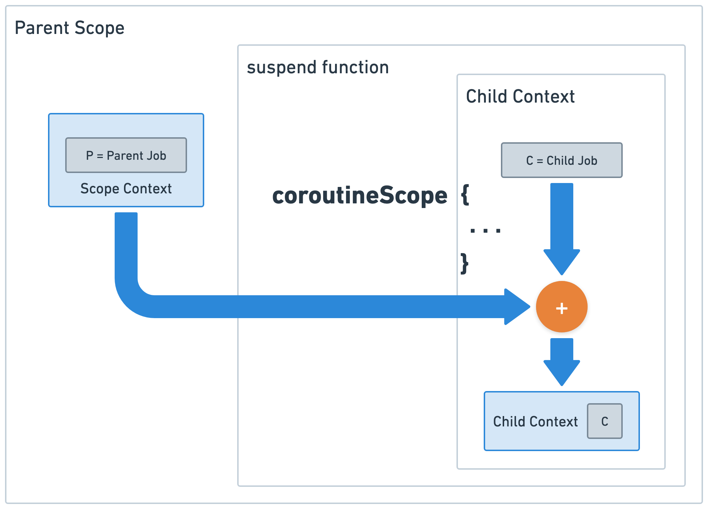

# Suspending vs. Blocking

코틀린 코루틴은 동시성 프로그램을 직관적으로 작성할 수 있도록 도와주는 유용한 도구다. 하지만 그 내겸이 일반적인 스레딩과는 다르기 때문에 의도한 방향대로 동작이 이뤄지지 않는 경우도 다반사다.
그 원인중 하나가 바로 중단의 개념을 제대로 이해하지 못하느데에서 온다.

## 코루틴에서 중단이란?

코루틴에서 가장 흔히 사용하는 중단이란 코루틴이 멈출 수 있다는 것을 의미한다.

* 함수에서는 `suspend fun` 이라는 키워드로 중단점을 만들 수 있다. 하지만 중단 함수 내부에 실제 중단을 일으키는 부분이 없을 경우 이름만 중단함수인 함수가 된다.
* 실질적으로 중단을 일으키는 가장 기본 함수는 `suspendCoroutine`이다. `delay`도 `suspendCoroutine` 블록으로 구현되어 있다.

코루틴은 스레드위에서 실행되는 중단 가능한 컴포넌트 혹은 태스크라고 정의할 수 있다. 따라서 코루틴이 중단되었다는 것은 **스레드가 중단되었다는 의미가 아닌 잠시 태스크가 멈춘 상태**라고 이해해야 한다.

## coroutineScope vs. runBlocking

코루틴의 중단과 스레드의 블록킹의 차이를 이해하는데 좋은 예시가 바로 `coroutineScope`와 `runBlocking`을 이해하는 것이다.

### coroutineScope

`coroutineScope`는 코루틴 스코프(코루틴 스코프 = 코루틴으로 이해해도 크게 문제 없다) 없이 자체적으로 코루틴을 만들 수 있는 코루핕 스코프 함수다.
보통 중단함수 내부에 코루틴을 생성해야 할 때 `coroutineScope` 블록을 정의해서 코루틴 빌더를 사용하게 된다.



`coroutineScope`의 특징을 나열해 보면;

* `coroutineScope`는 중단함수이면서 새로운 코루틴을 생성하는 함수다. 부모 코루틴의 컨텍스트를 받아 새로운 스코프를 만들며 내부의 코루틴이 완료될 때까지 부모 코루틴을 중단한다.
* `coroutineScope {...}` 블록 내부에 정의된 코루틴이 모두 끝날때까지 기다린다. 코루틴이 실행되고 있는 스레드를 블록 시키는 것이 아닌 코루틴을 기다리는 것이다.
* (참고) `coroutineScope`는 자기 자신 혹은 자식 스코프에서 발생한 예외를 부모로 전파하지 않고 바로 던지는 특징을 가지고 있다.

```Kotlin
@Test
fun coroutineScopeTest() {
    val elapsed = measureNanoTime {
        runBlocking {
            repeat(10) {
                coroutineScope {
                    delay(1000)
                }
            }
        }
    }
    // about 10 seconds.
    println("time elapsed: ${elapsed / 1_000_000} ms")
}
```

위 코드를 보면 `runBlocking`을 부모 코루틴으로 총 10개의 새로운 자식 코루틴이 `coroutienScope`에 의해서 생성된다. 
하지만 일반적인 코루틴 빌더와 다르게 `coroutineScope`는 부모코루틴을 중지시키고 내부의 코루틴이 끝날때 까지 기다린다. 

### runBlocking

`runBlocking`은 코루틴을 처음 배울 때 등장하는 코루틴 빌더로 코루틴이 없는 상태(non-coroutine world)에서 코루틴을 사용할 수 있도록 시작점을 여는 함수다.
뿐만 아니라 현재 작동하는 스레드를 내부 코루틴이 모두 종료될 때까지 블록시켜 외부 세계(non-coroutine world)와 코루틴 세계가 원활하게 작동할 수 있도록 돕는 역할을 한다.

`runBlocking`이 스레드를 블록시킨다는 의미를 이해하기 위해서 아래의 테스트를 실행해 보자. 

```Kotlin
@Test
fun threadStarvationTest() {
    val elapsed = measureNanoTime {
        runBlocking(Dispatchers.Default.limitedParallelism(1)) {
            val jobs = List(10) {
                launch { loadConfiguration() }
            }
            jobs.joinAll()
        }
    }
    println("time elapsed: {$elapsed / 1_000_000} ms")
}
```

`loadConfiguration` 함수는 내부적으로 `fetchConfiguration` 함수를 호출한다고 가정하자. 
```Kotlin
suspend fun fetchConfigurationData(): String {
    delay(1000)
    return "Some Data"
}
```

`loadConfiguration`을 두 가지 버전으로 만들어서 실행해보자.
```Kotlin
// option 1 (1초 소요)
suspend fun loadConfiguration() {
    val data = coroutineScope {
        fetchConfigurationData()
    }
    println("loaded: $data")
}

// option 2 (10초 소요)
suspend fun loadConfiguration() {
    val data = runBlocking {
        fetchConfigurationData()
    }
    println("loaded: $data")
}
```

`launch`를 이용해 만든 10개의 코루틴 내부에서 한 쪽은 `runBlocking`으로 한 쪽은 `coroutineScope`로 감쌌다. 
디스패처의 동시성 옵션을 1로 세팅했기 때문에 동시에 실행할 수 있는 스레드는 1개이다.

`runBlocking`으로 감싼 옵션 1의 경우는 총 10초가 소요되지만 `coroutineScope`로 감싼 옵션 2의 경우는 1초가 약간 넘는 시간이 소요된다.
`runBlocking`은 `delay(1000)`가 끝날때 까지 스레드를 블록시킨 반면 `coroutineScope`는 `delay(1000)`이 끝날때까지 기다리기 때문에 스레드가 다른 코루틴을 실행하는 것이 가능하다.

# 취소와 중단함수

취소에 있어서 중단과 블록킹은 전혀 다른 방식으로 동작한다. 정확하게 말하면 블록킹은 취소와 아무런 관련이 없다. 
코루틴은 구조화된 동시성(structured concurrency)을 지원하여 코루틴의 잡(Job)에 위계를 설정하여 생명주기를 관리한다.
취소도 그 중 하나로 코루틴에서는 `CancellationException` 타입의 예외가 발생할 경우 자식 코루틴을 비롯해서 부모 코루틴까지 취소를 전파한다.

하지만 취소가 동작하기 위해서는 코루틴 사이에 중단점이 존재해야 하는데, 
중단점에 도달해서 다음 단계를 실행할지 판단하는 과정에서 잡을 취소시키고 종료해야 하는지 판단하기 위해서이다.
코루틴이 취소되기 위해서는 중단점이 꼭 필요하다.

## 코루틴에서 Blocking I/O 사용하기


## withTimeout은 어떻게 작동할까?

## withTimeout 올바르게 사용하기

# References

* _마르친 모스카와. [코틀린 코루틴](https://product.kyobobook.co.kr/detail/S000210537188). 인사이트_
