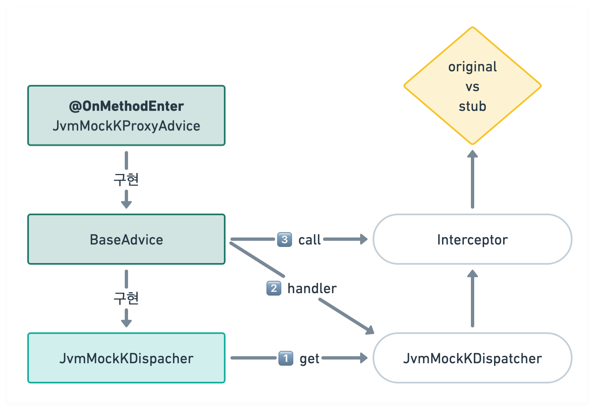
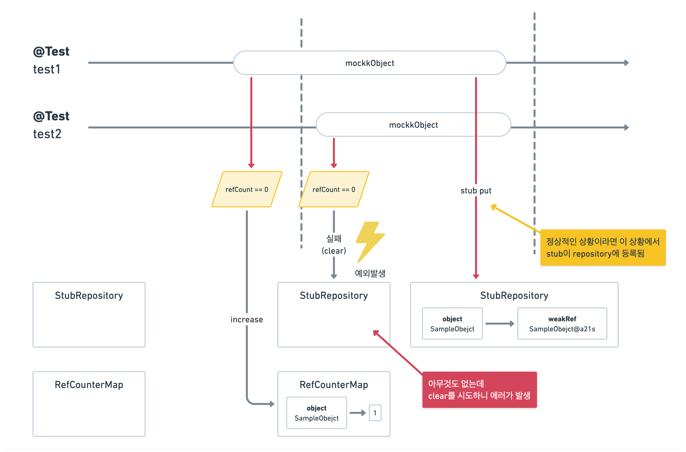
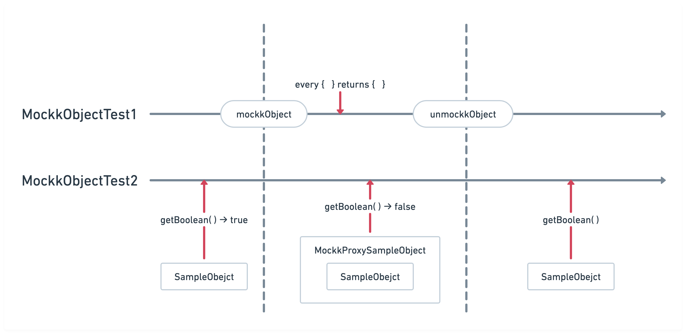

# mockkObject

Kotlin을 사용한다면 대체로 mock 라이브러리로 mockk를 많이 선택하게 됩니다.
그만큼 직관적이로 약간의 온보딩 과정만 거친다면 실제로 테스트 코드를 작성하는데 큰 어려움이 없기 때문입니다.
하지만 이면에는 mockk가 가지는 고질적인 속도 문제와 동기화 문제도 존재합니다.

mockk가 지원하는 mockkObject는 Kotlin의 object class를 쉽게 목(mock) 객체로 만들어 줍니다.
하지만 이런 마법같은 작용 뒤에는 생각보다 치명적인 동기화 이슈가 숨어져 있습니다.

## 문제의 발단
문제의 발단은 사내에서 사용하는 build 파이프라인이 테스트의 실패로 깨지기 시작한 것이었는데요.
억울한 것이 상황에 따라서는 성공을 때로는 실패를 하는 전형적인 flaky한 테스트 군집의 특성을 보였습니다.
간혹 실패하는 테스트를 살펴보면 아래와 같은 에러메시지를 확인할 수 있었는데요.

```
io.mockk.MockKException: can't find stub Companion(object Companion)
    at io.mockk.impl.stub.StubRepository.stubFor(StubRepository.kt:16)
    at io.mockk.impl.recording.states.AnsweringState.call(AnsweringState.kt:13)
```

실제로 실패가 발생한 코드 내부를 보면 프로파일을 추출하는 object class인 `ProfileIdentifier`에 해당하는 목 객체를 조회하는 과정에서 발생한 문제라는 것을 알 수 있었습니다.
하지만 놀라운 사실은 해당 테스트에서는 `ProfileIdentifier`를 목으로 변환하지 않았다는 점이었습니다.

최종적으론 다른 테스트 클래스에서 사용하는 mockkObject로 인해서 목 생성을 하지 않았음에도 mockk와 관련된 에러를 만났다는 것을 직관적으로 알 수 있었는데요.
좀 더 자세하게 왜 이런 일이 발생할 수 있었는지 mockkObject의 동작원리와 함께 이해해 봅시다.

## mockkObject의 동작 원리

mockkObject 메서드를 실행하면 SpyKStub이 생성되고 cancellation 람다가 같이 등록됩니다.
과정을 세부적으로 코드와 함께 살펴보겠습니다.

1. stub을 생성합니다.
    ```Kotlin
   // JvmObjectMockFactory.kt - objectMockk() 
   val stub = SpyKStub(cls, "object " + cls.simpleName, gatewayAcess, 
        recordPrivateCalls, MockType.OBJECT)
    ```
2. StubRepository에 stub 등록하고 전역적으로 관리합니다.
    ```Kotlin
   // JvmObejctMockFactory.kt - objectMockk()
   stubRepository.add(obj, stub)
   ```
3. cancellation 람다를 생성하여 목 해제시 함수가 실행될 수 있도록 합니다.
    ```Kotlin
   // JvmObejctMockFactory.kt - objectMockk()
   return {
       if (refCntMap.decrementRefCnt(obj)) {
           val stub = stubRepository.remove(obj)
           stub?.let {
               it.dispose()
           }
       }
   }
   ```
   이어서 취소 람다를 레지스트리에 등록합니다.
    ```Kotlin
   // API.kt - internalMockkObject()
   MockKCancellationRegistry
       .subRegistry(MockKCancellationRegistry.Type.OBJECT)
       .cancelPut(it, cancellation)
   ```
4. 목 해제 시점에서 레지스트리에 등록된 람다를 실행합니다.
   ```Kotlin
   // API.kt - internalUnmockkObject()
   MockKCancellationRegistry
       .subRegistry(MockKCancellationRegistry.Type.OBJECT)
       .cancel(it)
    ```
   
mockkObject로 생성된 목 객체가 전역적인 StubRepository 
싱글톤인 object class의 특징상 전역적으로 목 객체를 관리하는 것이 뭐가 문제냐고 되물을 수 있겠지만, 
목 객체를 만든다는 것은 테스트 내부에서 제한적으로 사용하겠다는 의미를 가지기도 합니다.
테스트 환경을 위해서 만든 객체가 전역적으로 관리된다는 점이 의아할 수 밖에 없는 상황입니다.

### (참고) 일반 object 객체와 목 객체를 어떻게 구분할 수 있을까?
여기서 잠깐 궁금증이 드는 부분은 테스트 실행시 실행 환경에서 접근한 객체가 목 객체인지 원래 객체인지 어떻게 알 수 있을까 인데요.
object class의 경우 똑같이 싱글톤 클래스의 레퍼런스를 참조할텐데 어디서 이를 구분할 수 있는지 확인해 봅시다.

코드를 추적하다보면 mockk에서는 어드바이스를 등록해서 객체에 접근할 때 프록시 핸들러가 존재하는지 확인후, 인터셉터를 이용해서 stub(목 객체)이 결과로 나오도록 처리한다는 것을 알 수 있습니다.

```Java
// JvmMockKProxyAdive.java
public class JvmMockKProxyAdvice extends BaseAdvice {
   @OnMethodEnter(skipOn = OnNonDefaultValue.calss)
   private static Callable<?> enter(...)
}
```

mockk에서 어드바이스가 동작하는 과정을 자세하게 살펴보겠습니다.

1. JvmMockDispatcher에서 적절한 JvmMockDispatcher를 가져옵니다.
   ```Java
   // JvmMockKDispatcher.java
   public class JvmMockKDispatcher get(long id, Object obj) {
      if (obj == DISPATCHER_MAP) {
         return null;
      }
      return DIPATCHER_MAP.get(id);
   }
   ```
2. 추출한 디스패처의 핸들러를 동작시킵니다.
   ```Java
   // JvmMockKProxyAdvie.java - enter()
   JvmMockKDispacher  dispatcher = JvmMockKDispatcher.get(id, self);
   
   if (dispatcher == null || !dispatcher.isMock(self)) {
      return null;
   }
   
   return dispatcher.handler(self, method, arguments);
   ```
3. 핸들러가 실행되면 인터셉터가 호출되어 목 객체를 반환합니다.
   ```Kotlin
   // BaseAdvice.java - handler()
   fun handler(self: Any, method: Method, arguments: Array<Any?>): Callable<*>? {
      val handler - handlers[self] ?: return null
      
      retrn if (SelfCallEliminator.isSelf(self, method) {
         null
      } else {
         Intercaptor(handler, self, method, arguments)
      }
   }
   ```
4. 이때 인터셉터는 목 객체의 존재 여부에 따라 원본 객체를 반환할지 stub을 호출할지 결정합니다.
   ```Kotlin
   // Intercpetor.kt - call()
   fun call(): Any? {
      val callOriginalMethod = SelfCallEliminatorCallable(
         MethodCall(self, method, arguments),
         self,
         method
      )
      return handler.invocation(self, method, callOriginalMethod, arguments)
         ?.boxedValue // unbox value calss objects
   }
   ```
   JvmMockFactoryHelper의 invocation 메서드를 호출합니다.

   ```Kotlin
   // JvmMockFactoryHelper.kt - invocation()
   object JvmMockFactoryHelper {
      fun mockHandler(stub: Stub) = object : MockKInvocationHandler {
         override fun invocation(self: Any, method: Method?, originalCall: Callble<*>?, args: Array<Any?>) =
            stdFunctions(self, method!!, args) {
               stub.handlerInvocation(
                  self,
                  method.toDescription(),
                  {
                     handlerOriginalCall(originalCall, method)
                  },
                  args,
                  findBanckingField(slef, method)
               )
            }
      }
   }
   ```

구성이 복잡하니 다이어그램으로 나타낸다면 아래와 같습니다. 
다이어그램을 살펴보면 전형적인 프록시 패턴으로 구현된 reflect 패키지와 유사한 구조를 가진다는 것을 알 수 있습니다.


## mockkObject와 동시성 이슈





## 개선 방향

# static 객체 테스트

## mockkObject 그대로 사용해도 될까?

## static 객체 mocking은 smell 일 수 있다.
