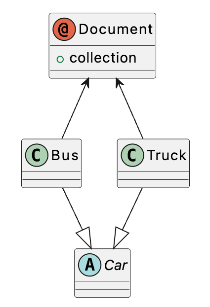
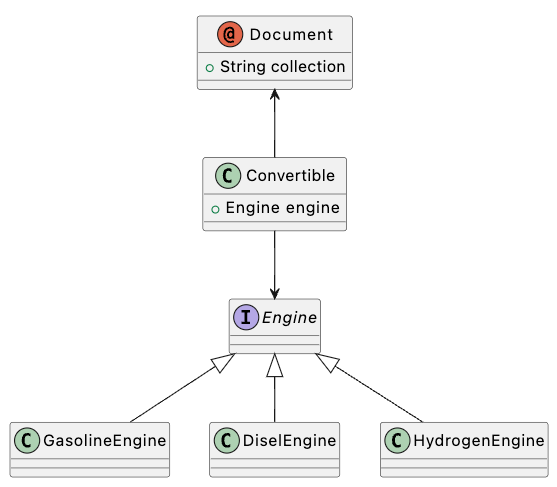
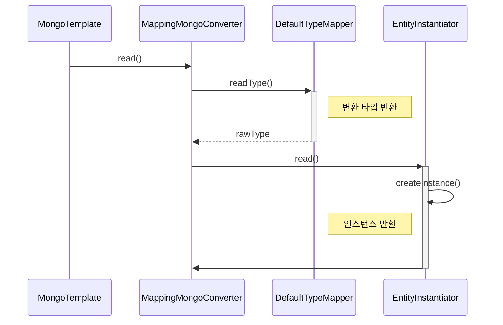
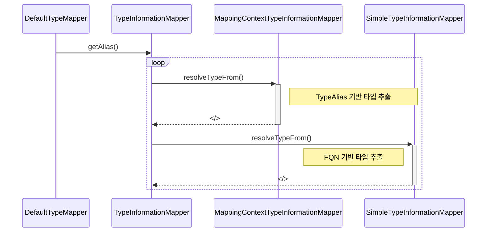

# _class 대체 왜 사용하는 것일까?

spring-data-mongo를 사용하다보면 은연중에 `_class`가 도큐먼트에 등록되는 상황을 심심치않게 볼 수 있다. 이는 MongDB가 가지는 스키마리스의 성질을 보완하고자 spring-data-mongo에서 기본적으로 의도적으로 등록하는 필드 값이다.

`_class` 필드는 ORM 매핑시 다형성을 활용하여 도큐먼트를 객체(POJO)와 매핑하는 상황에서 사용된다. 먼저 다형성을 이용해서 도큐먼트를 매핑(설계)한다는 의미부터 짚고 넘어가자.

## 도큐먼트와 다형성
다형성(polymorphism)은 프로그래밍 언어에서 한 객체가 여러 타입의 형태로 사용할 수 있는 경우를 의미하는데, 이를 활용하면 특정 인터페이스를 상속받은 여러 객체를 하나의 컬렉션에 저장하는 것이 가능하다.



하지만 위의 그림은 다형성을 적용한 형태가 아니다. 다형성을 적용했다는 것은 하나의 컬렉션(collection)에 서로 다른 타입(하지만 같은 인터페이스)이 포함되는 경우다. 위의 UML은 `Bus`와 `Truck`이 따로따로 컬렉션으로 분리되어 저장된다.



위와 같은 형태가 MongoDB를 사용하면서 다형성을 기반으로 컬렉션을 정의한 상황이라고 할 수 있다. `Convertible` 객체는 필드값으로 `engine`을 가지며 이를 상속하는 서로 다른 3개의 내부 문서(sub-document)가 존재하게 되는것이다. 

하나의 컬렉션에 여러 타입의 객체를 한 번에 저장할 수 있다는 장점이 있지만, 저장된 문서를 불러오는 과정에서는 `engine`에 해당하는 원래의 구상 타입(concrete type)이 무엇이었는지 변환과정에서 추가 정보가 필요하다. spring-mongo-jpa는 이러한 매핑 상황에서 활용하기 위해 구상 클래스의 전체 경로를 `_class`에 담아 도큐먼트와 같이 저장시킨다.

```json
{
  "name": "mustang",
  "engine": {
    "createdDate": "2012-03-23",
    "horsePower": 80,
    "_class": "io.github.goomon.domain.model.GasolinEngine"
  },
  "_class": "io.github.goomon.domain.model.Convertible"
}
```

JSON을 객체로 변환할 때 `_class`를 참고해서 매핑할 클래스를 찾게 된다.

## MongoTemplate Mapping Process

spring-data-mongo가 `_class`를 어떻게 사용하는지 이해하기 위해서 `MongoTemplate`이 문서를 객체로 매핑하는 과정을 살펴보자.



도큐먼트를 읽어와 타입으로 변환하는 과정에서 가장 중요한 것은 **해당 도큐먼트가 어떤 타입과 매핑되는지 결정**하는 것이다.

하지만 디버깅 모드로 몇 번만 돌려보면 `_class` 필드의 유무와 상관없이 `typeHint`에 클래스 경로에 대한 정보가 사전에 들어 있는 것을 확인할 수 있다. 즉 다형성을 사용하지 않는 일반적인 경우라면 `_class` 없이도 영속성 객체에 저장된 정보만으로 객체를 매핑하는데 전혀 문제가 없다. **도큐먼트가 영속성 객체로 관리되는 상황에서 이미 `MongoTemplate`은 도큐먼트의 기본 클래스 패스를 알고 있기 때문**이다.

하지만 만약 도큐먼트에 등록된 클래스 정보가 추상클래스(abstract class) 혹은 인터페이스일 경우에는 어떻게 될까? 정상적으로 클래스를 만들 수 없기 때문에 적절한 구체 타입을 찾는 과정이 필요하고 spring-data-mongo에서는 `_class`를 참고하게 된다.

### 절절한 도큐먼트 타입찾기 - DefaultTypeMapper.java

매핑할 타입을 찾는 과정은 아래와 같다.


> 

```Java
// DefaultTypeMapper.java
public <T> TypeInformation<? extends T> readType(S source, TypeInformation<T> basicType) {

    Class<?> documentsTargetType = getDefaultedTypeToBeUsed(source);
    
    // 도큐먼트의 타켓 타입을 찾지 못할 경우 basicType(typeHint와 같은)을 기본 타입으로 인지하게 된다.
    if (documentsTargetType == null) {
        return basicType;
    }

    Class<T> rawType = basicType.getType();

    // 더 세부적인 타입이 있는지 확인하는 부분이다.
    boolean isMoreConcreteCustomType = rawType == null
            || rawType.isAssignableFrom(documentsTargetType) && !rawType.equals(documentsTargetType);

    // 세부적인 타입이 존재하지 않는 경우 마찬가지로 기본타입을 반환한다.
    if (!isMoreConcreteCustomType) {
            return basicType;
    }

    ClassTypeInformation<?> targetType = ClassTypeInformation.from(documentsTargetType);
    return (TypeInformation<? extends T>) basicType.specialize(targetType);
}
```

아무런 설정 없이 spring-data-mongo를 사용하게 되면 `DefaultMongoTypeMapper`를 기본 매핑 클래스로 사용하게 된다.

```Java
// DefaultTypeMapper.java

@Nullable
private Class<?> getDefaultedTypeToBeUsed(S source) {
		// 도큐먼트 타켓 타입을 불러오는 부분
		TypeInformation<?> documentsTargetTypeInformation = readType(source);
		documentsTargetTypeInformation = documentsTargetTypeInformation == null ? getFallbackTypeFor(source)
				: documentsTargetTypeInformation;
		return documentsTargetTypeInformation == null ? null : documentsTargetTypeInformation.getType();
}
```
- `documentsTargetTypeInformation`에 들어갈 적절한 타입을 찾지 못하면 `java.util.Map`이 들어간다.
- 결국 구체 타입을 가져오지 못했기 때문에 이 값은 `typeHint`에서 제공한 값을 참조하여 인스턴스로 변환을 시도한다.
- 하지만 만약 기본 베이스 클래스(`typeHint`)가 인터페이스나 추상 클래스일 경우 인스턴스를 생성하는 문제가 발생한다.



### 절절한 도큐먼트 타입찾기 - TypeAlias vs FQN

타입을 가져오는 과정을 이해하기 위해서 `readType`을 살펴보자. 이 과정에서 약어(alias)를 바탕으로 타입을 찾올지 `_class` 값을 그대로 사용하여 값을 찾을지 결정하게 된다.

```Java
@Nullable
public TypeInformation<?> readType(S source) {
		return getFromCacheOrCreate(accessor.readAliasFrom(source));
}

private TypeInformation<?> getFromCacheOrCreate(Alias alias) {
		// cache hit일 경우 아래 과정을 스킵하게 된다.
		Optional<TypeInformation<?>> typeInformation = typeCache.get(alias);

		if (typeInformation == null) {
				// 위에 디폴트로 정의한 람다가 실행되는 부분
				typeInformation = typeCache.computeIfAbsent(alias, getAlias);
		}

		return typeInformation.orElse(null);
}
```

약어를 바탕으로 타입을 찾기 위해 `DefaultTypeMapper.java`에서 2가지 중요 값을 가지고 있다.

| 프로퍼티 | 설명 |
| --- | --- |
| getAlias | 람다로 alias 값을 가져오기위한 로직이 정의되어 있다. |
| typaCache | alias된 데이터를 캐싱하여 가지고 있는 맵 형태의 값이다. |

생성자에서 정의되는 `getAlias` 람다는 아래와 같다.

```java
this.getAlias = key -> {
    for (TypeInformationMapper mapper : mappers) {
        TypeInformation<?> typeInformation = mapper.resolveTypeFrom(key);
        if (typeInformation != null) {
            return Optional.of(typeInformation);
        }
    }
    return Optional.empty();
};
```

`mapper` 리스트를 순회하면서 타입을 찾게 된다. 먼저 약어 기반으로 타입을 탐색한다.

```java
public TypeInformation<?> resolveTypeFrom(Alias alias) {
    ...
    for (PersistentEntity<?, ?> entity : mappingContext.getPersistentEntities()) {
        // 엔터티에 정의된 타입 매핑 정보를 바탕으로 약어(alias) 정보를 가져온다.
        if (entity.getTypeAlias().hasSamePresentValueAs(alias)) {
            return entity.getTypeInformation().getRawTypeInformation();
        }
    }
    return null;
}
```

이 과정에서 타입을 찾지 못한다면 `_class` 이름을 기반으로 타입을 찾게 된다.

```java
public TypeInformation<?> resolveTypeFrom(Alias alias) {
    String stringAlias = alias.mapTyped(String.class);
    if (stringAlias != null) {
        return cache.computeIfAbsent(stringAlias, SimpleTypeInformationMapper::loadClass).orElse(null);
    }
    return null;
}
```

### 인스턴스 생성하기 - MappingMongoConverter.java

만약 `_class`를 이용해서 구체 타입을 결정하지 못할 경우 `typeHint`를 통해 알고 있는 타입을 그대로 사용하게 된다. 만약 타입 힌트를 통해 가져온 타입 정보가 정상적인 구체 클래스가 아니라면 **컨버터는 결국 추상 클래스 기반으로 인스턴스 생성을 시도하게 되고 에러가 발생**한다.

```java
private <S extends Object> S read(ConversionContext context, MongoPersistentEntity<S> entity, Document bson) {
		...
		EntityInstantiator instantiator = instantiators.getInstantiatorFor(entity);
		// 여기서 예외를 던지는 instantiator가 반환된다.
		**S instance = instantiator.createInstance(entity, provider);**

		return instance;
}
```

내부적으로 조금만 더 들어가 보자.

```java
public <T, E extends PersistentEntity<? extends T, P>, P extends PersistentProperty<P>> T createInstance(E entity,
    ParameterValueProvider<P> provider) {
    EntityInstantiator instantiator = this.entityInstantiators.get(entity.getTypeInformation());
    if (instantiator == null) {
        instantiator = potentiallyCreateAndRegisterEntityInstantiator(entity);
    }
    return instantiator.createInstance(entity, provider);
}
```

재미있는 사실은 `instantiator`의 경우 도큐먼트와 연관된 모든 클래스 정보를 해시맵으로 저장하고 있다는 사실이다.

### 정리

1. 기본 타입을 가져온다.
    - 여기서 기본 타입이란 약어(alias)로 등록된 클래스 정보가 등록되어 있는지 확인하는 과정이다.
    - 약어 정보는 엔터티(entity)로 등록된 데이터를 바탕으로 가져온다. (캐싱이 적용될 경우 entity 등록정보 없이 매핑 정보가 저장된다.)
    - `TypeAlias` 정보는 캐싱을 이용해 내부적으로 변환 클래스를 맵 형태로 저장한다.
    - `TypeAlias`를 사용하지 않은 경우는 `SimpleTypeInformationMapper`에 의해 `_class` 이름 그대로 매핑된다.
2. 기본타입이 null이라면 `basicType`을 타입으로 설정한다.
    - 만약 `basicType`이 abstract class 혹은 interface일 경우 후에 인스턴스 생성에서 문제가 생긴다.
3. 구체화된 타입이 있는지 확인한다. 마찬가지로 구체화된 타입이 없다면 `basicType`을 기본 타입으로 설정한다.

# 어떻게 관리하는게 좋을까?

이 뒷부분 부터는 필자의 개인적인 생각이다.

### 1. _class를 사용하지 말자.

MongoDB를 사용하기위해 설정하는 옵션 중에서 기본 타입을 null로 세팅하면 `_class`를 사용하지 않게 된다. `_class`를 사용하게 되면 엔터티의 경로 변경에서 자유로울 수 없기 때문에 리팩토링 과정에서 서로다른 FQN이 하나의 컬렉션에 존재하는 골치아픈 상황이 발생할 수 있다. 또한 `_class`가 굳이 필요없는 상황에서 불필요한 디스크를 잡아먹는 주요 요인이 될 수 있다.

```Kotlin
@Bean
fun mappingMongoConverter(
    mongoDbFactory: MongoDatabaseFactory,
    mongoMappingContext: MongoMappingContext,
    mongoCustomConversions: MongoCustomConversions,
): MappingMongoConverter? {
    val dbRefResolver: DbRefResolver = DefaultDbRefResolver(mongoDbFactory)
    val converter = MappingMongoConverter(dbRefResolver, mongoMappingContext)

    converter.setCustomConversions(mongoCustomConversions)
    converter.setTypeMapper(DefaultMongoTypeMapper(null))

    return converter
}
```

단, 이 방법은 MongoDB에 다형성을 바탕으로한 문서를 저장할 경우 커스텀 컨버터를 만들어 객체로 변환하는 추가적인 작업이 필요할 수 있다는 단점이 있다. 

### 2. 이미 _class를 사용했다면 TypeAlias 전략을 고민해 보자.

이미 `_class`를 사용하고 있는 경우라면 `@TypeAlias`의 사용을 진지하게 고민해볼 필요도 있다. 보통은 도큐먼트 클래스 이름으로 설정해서 사용해서 FQN 대신 약어가 저장되도록 설정할 수 있다.

하지만 이 방법 또한 이미 `@TypeAlias`를 고정시킨 경우라면 후에 바꾸는 것이 쉽지 않을 수 있다. 되도록이면 깔끔하게 구체 클래스를 사용해서 MongoDB를 사용하는 것이 부수효과를 줄이고 운영상에서의 리팩토링의 리스크를 줄일 수 있는 방법이지 않을까 생각된다.
